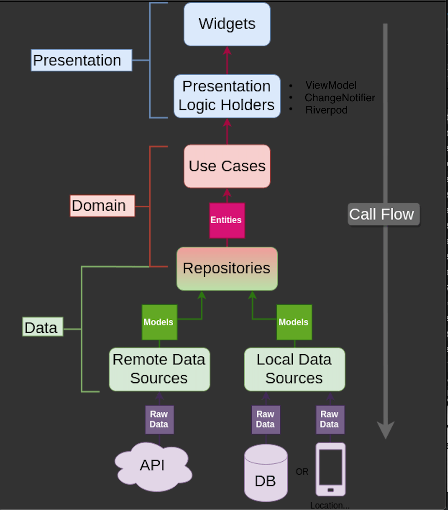

# Flutter Architecture Blueprints

Flutter Architecture Blueprints is a project that combine clean architecture with MVVM pattern to developing. Flutter apps.

## Documentation

- [Install Flutter](https://flutter.dev/get-started/)
- [Flutter documentation](https://flutter.dev/docs)
- [The Clean Architecture (Uncle Bob)](https://blog.cleancoder.com/uncle-bob/2012/08/13/the-clean-architecture.html)
- [MVVM pattern](https://en.wikipedia.org/wiki/Model%E2%80%93view%E2%80%93viewmodel)
- [Riverpod](https://riverpod.dev/)

## Requirements

- [Flutter <1.22.6](https://flutter.dev/docs/development/tools/sdk/releases)

## Environment


**iOS**
- iOS 13+

**Android**
- Android 5.1+
    - minSdkVersion 22
- targetSdkVersion 30

## App architecture

There are 3 main modules to help separate the code. They are Data, Domain, and Application.
   
- **Data (Particular project)** contains Local/Remote Data Source, APIs, Data objects (Request/Response object, DB objects), and the repository implementation.
   
- **Domain (Particular project)** contains UseCases, Domain Objects/Models, and Repository Interfaces
   
- **Presentation** contains UI, style, app configurations, viewmodel (hold view state and presentation logic), etc. Can be split into separate modules itself if needed. For example, we could have a module called Device handling things like camera, location, etc.

# Entities
 - Enterprise-wide business rules
 - Made up of classes that can contain methods
 - Business objects of the application
 - Used application-wide
 - Least likely to change when something in the application changes
# Repository
 - Bridge between Data layer and Domain layer
 - Connects to data sources and returns mapped data
 - Data sources include DB, Api etc...
# UseCase
 - Responsible for connecting to repository to retrieve necessary data. 
 - This is where the business logic takes place.
 - Returns data downstream.
 - Single responsibility.
# ViewModel
 - Organizes data and holds View state.
 - Communicate with use cases.
 - Using [Riverpod](https://riverpod.dev/) for state management.
# View
 - Observes changes from ViewModel.
 - Updates UI.


<h3 align="center">Architecture</h3>


## Getting Started

### Setup

```shell script
make setup
make build-runner
```

### Run

```shell script
make run
```

### Build APK

```shell script
make build-apk
```

### Test

- [Mockito](https://pub.dev/packages/mockito)
- Write unit test for ViewModel (**CardsViewModel** & **ComponentsViewModel**).
- Able to write particular unit test for **data** module and **domain** module.

```shell script
make test
```
